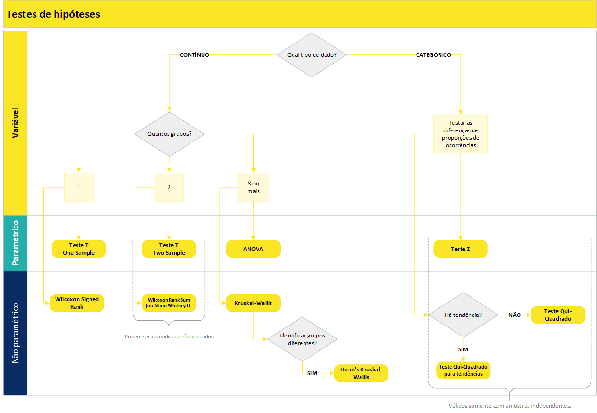

# Análise de Hipóteses

```{r, echo=FALSE, message=FALSE}
library(dplyr)
aux <- NULL
aux$colors <- c("#aabbcc", "#ccbbaa", "#bbccaa")
```

Esta seção apresenta detalhes sobre os testes estatísticos aplicados para avaliar hipóteses de negócio levantadas a partir de interação com o cliente.

A estatística possui uma área chamada de **teste de hipóteses**, que viabiliza verificar ou refutar uma hipótese existente acerca do comportamento dos dados. Os testes de hipóteses são muito utilizados no **meio acadêmico**, mas também possuem grande valor se usados de forma adequada no **contexto corporativo**.

Nas empresas existem diversas crenças acerca de como as coisas acontecem e se relacionam. Formalizar estas crenças em **hipóteses de negócio** permite que sejam formuladas **hipóteses estatísticas**, as quais podem ser testadas e validadas (ou não) com o uso de testes de hipóteses.

Porém, para que os resultados dos testes sejam corretos, é preciso conhecer os principais tipos de testes existentes e alguns dos seus conceitos. Assim é possível direcionar para a aplicação correta a ser utilizado em cada hipótese.

Basicamente os **passos para uma boa execução** de testes de hipóteses são:

1. Definir uma **hipótese de negócio**;
2. Transformá-la em uma **hipótese estatística**;
3. **Escolher o teste correto** baseado nas características dos dados e no resultado esperado;
4. **Transformar os dados** para que estejam de acordo com o *input* exigido pelo teste escolhido;
5. **Aplicar** o teste de hipótese.

<div style="background:#f5f5f5; padding:20px; margin: 10px;">

#### Por que Utilizar um Teste de Hipótese? {.unnumbered}

Quando as tabelas dinâmicas do Excel já não são suficientes para que os resultados das análises sejam conclusivas é um bom indicativo de que já passou da hora de utilizar testes de hipóteses.

Um teste de hipótese auxilia a eliminar a incerteza que permanece mesmo após procedimentos de sumarização dos dados, como ocorre nas tabelas dinâmicas dos *softwares* de planilha eletrônica.

Por exemplo, uma organização quer saber se os homens possuem salário superior às mulheres em um determinado cargo. A tabela dinâmica vai trazer o resultado, que pode ser expresso através da média dos salários daquele cargo em cada gênero (masculino ou feminino). Porém, o resultado da média pode mostrar apenas uma diferença pequena entre os salários de homens e mulheres, o que acaba deixando no ar a dúvida inicial e nenhuma conclusão pode ser tomada.

Um teste de hipótese estatística é capaz de dizer (quando bem aplicado) que o salário das mulheres é de fato menor ou maior naquele caso, e que o resultado mostrado na média não é uma simples obra do acaso. 

</div>

## Conceitos Importantes sobre os Testes de Hipóteses

Uma hipótese estatística, formalmente, é uma afirmação sobre alguma característica da população. Um teste de hipótese, por sua vez, **é um procedimento estatístico para dizer se uma afirmação sobre a população é verdadeira**. 

Se a probabilidade de ocorrência de um evento atrelado à hipótese for baixa, então a hipótese é assumida como não verdadeira.


### Hipótese Nula e Hipótese Alternativa {.unnumbered}


Todo teste de hipóteses precisa de uma **hipótese nula** ($H_0$) e uma **hipótese alternativa** ($H_1$). 

A $H_0$ é uma afirmação que **sempre representará uma igualdade**. Por exemplo: "a média salarial de homens **é igual** a média salarial de mulheres"; "colaboradores com maior grade **possuem o mesmo** tempo de empresa que colaboradores com menor grade". Veja que a $H_0$ pode ser dividia em duas declarações, que chamaremos de $X$ e $Y$. Nos exemplos citados, as declarações que representam $X$ seriam "média salarial de homens" e "colaboradores com maior grade"; enquanto $Y$ seriam "média salarial de mulheres" e "colaboradores com menor grade".

Já quando olhamos para $H_1$, temos três possibilidades de configurações: existe diferença, é maior ou  é menor. Olhando para as declarações de $X$ e $Y$, poderíamos ter como hipótese alternativa à $H_0$, citada acima, que "a média salarial de homens **é maior** que a média salarial de mulheres". Ou ainda, quando não temos um palpite definido (se maior ou menor), podemos definir $H_1$ como "colaboradores com maior grade possuem tempo de empresa **diferentes** que colaboradores com menor grade".

Resumindo, para definirmos as hipóteses nula e alternativa teremos:

  $H_0 : X = Y$
  
  $H_1 : X \neq Y ~\text{ou}~ X < Y ~\text{ou}~ X > Y$


### Qual a Decisão em um Teste de Hipótese?  {.unnumbered}

Em um teste de hipóteses a decisão será sempre **rejeitar a hipótese nula** ou **não rejeitar a hipótese nula**.

Para isso, os testes geram um *p-valor* para representar a **probabilidade de significância** estatística (métrica que vai de 0 a 1). **Quanto mais próximo de 0 o *p-valor*, mais significativa é a diferença testada**.


> Um **baixo p-valor** indica **forte evidência** contra a hipótese nula, o que leva à **rejeição** de $H_0$


De forma geral, recomenda-se **rejeitar $H_0$** com **_p-valor_ menor que $0,05$** (ou $5\%$). Em alguns casos específicos, o nível de significância **pode ser de $10\%$**.

### Testes Paramétricos e não Paramétricos? {.unnumbered}


**Testes paramétricos** assumem que os dados são distribuídos aleatoriamente a partir da população e que seguem uma **distribuição normal**.

**Testes não paramétricos** também assumem que os dados são aleatoriamente distribuídos a partir da população, mas **não exigem que sigam uma distribuição normal**. 

Os testes não paramétricos, além de não exigirem "normalidade" na distribuição dos dados, também apresentam resultados melhores quando aplicados em **amostras pequenas**. Por esses motivos, em casos reais normalmente são os preferidos e mais adequados em testes de hipóteses.

A questão que permanece é **como saber se o teste a ser escolhido é paramétrico ou não paramétrico**?

A resposta é simples: se o dado a ser testado segue uma distribuição normal, então recomenda-se utilizar testes paramétricos; caso o dado não possua distribuição normal então utiliza-se testes não paramétricos.

Quando o dado é normalmente distribuído então alguns testes podem trazer inferências sobre intervalos, pois já se conhece a distribuição. Já os testes não paramétricos não se baseiam na distribuição dos dados.

Testar a normalidade de uma série de dado é bastante simples pela linguagem R. Uma das possibilidades é utilizar o teste [Shapiro-Wilk](https://en.wikipedia.org/wiki/Shapiro%E2%80%93Wilk_test) por meio da função `shapiro.test()`. O teste possui hipótese nula ($H_0$) de que o dado é normalmente distribuído, a qual recomenda-se ser rejeitada a um p-valor menor que 0,05. Em outras palavras, se o p-valor for maior que 0,05 então assumimos que o dado é normalmente distribuído e seguimos com testes paramétricos; caso contrário procuramos um teste adequado entre os não paramétricos.  

### Testes Pareados e não Pareados {.unnumbered}

Em testes para **dados pareados** as amostras são **dependentes**. Aplicam-se, por exemplo, no caso das duas métricas que serão comparadas serem obtidas a partir do **mesmo indivíduo**, antes e após um tratamento. 


<div style="background:#f5f5f5; padding:20px; margin: 10px;">
<h5>**Exemplo** de teste pareado</h5>

Após um colaborador receber movimentação salarial por mérito, sua produtividade melhora.  

<hr>
  
Para validar esta hipótese um teste pareado sobre as observações de produtividade deveria ser executado com duas amostras do mesmo colaborador: uma antes e outra depois da movimentação salarial por mérito.

</div>

Em testes para **dados não pareados** os dados são coletados de **indivíduos distintos** e que pertencem a grupos também distintos. As amostras a serem testadas são **independentes**.

<div style="background:#f5f5f5; padding:20px; margin: 10px;">
<h5>**Exemplo** de teste não pareado</h5>

As avaliações de lideranças na área de TI são inferiores às avaliações na área de Recursos Humanos .

<hr>
  
Para validar esta hipótese é necessário um teste não pareado sobre as notas dos líderes em cada área.
  
</div>


Vale ainda ressaltar que, em testes para dados pareados, obrigatoriamente o tamanho das amostras deve ser igual (afinal, as amostras devem ser "pares"). Já em testes não pareados os tamanhos das amostras podem ser diferentes.


## Tipos de Testes

Existem diversos testes de hipóteses, sendo que cada um é mais adequado para uma situação específica. A seguir são apresentados alguns testes (não todos, pois existem diversos) que servem para a maior parte das situações que envolvem testes de hipóteses.

### Testes de Proporções

Os testes de proporções são adequados quando se têm **variáveis binárias ou categóricas** (ou numéricas divididas em faixas, como renda, idade ou número de funcionários), e se deseja saber se determinada característica é mais ou menos presente em um certo tratamento. Alguns exemplos de hipóteses alternativas a serem verificadas com testes de proporções:

- O *turnover* voluntário é maior em colaboradores do gênero masculino do que feminino;
- Há um maior índice de *turnover* voluntário em colaboradores cuja frequência de viagem a trabalho é maior.

Veja, *turnover* é uma variável binária, que indica quando um colaborador é desligado ou não, e o que normalmente se deseja testar com esta variável são casos em que há maior ou menor índice de *turnover*. Este é um tipo de situação em que é adequado aplicar testes de proporções. 


#### Teste Z {.unnumbered}

É um teste **paramétrico** utilizado para comparar diferenças de proporções entre duas amostras independentes. É idêntico ao teste Qui-Quadrado para diferença de proporções (apresentado a seguir), exceto que este permite estimar o desvio-padrão pela distribuição normal. Um cuidado que deve-se tomar com este teste é relacionado a sua aplicação em amostras que não são independentes. A equação implementada na linguagem R para teste de proporções não contempla o teste Z, apenas o Qui-Quadrado. 

[Usos e mau usos do Teste Z](https://influentialpoints.com/Training/z-test_for_independent_proportions_use_and_misuse.htm)

#### Teste Qui-Quadrado ($X^2$) {.unnumbered}

É uma alternativa **não paramétrica** ao teste Z. O teste *Chi-Squared* para proporções é um dos testes estatísticos mais utilizados. É mais adequado para amostras pequenas que o teste Z. Um dos seus principais usos incorretos está atrelado também a não independência entre as amostras.

[Usos e mau usos do Person's Chi-Squared Test](https://influentialpoints.com/Training/Pearsons_chi_square_test_of_independence_use_and_misuse.htm)

Na linguagem R há uma função nativa para este teste, `prop.test()`, que necessita como input (i) a quantidade de ocorrências para cada evento e (ii) o total de casos. Assim, o próprio teste calcula as proporções. Além disso, é possível aplicar o teste também para verificar se há diferença entre **mais de duas amostras**, e também verificar se há **tendência nas proporções** entre os grupos, por meio da função `prop.trend.test()`.


#### Teste de Fisher {.unnumbered}

O teste exato de Fisher é um teste não paramétrico que tem o objetivo de testar a independência de duas ou mais variáveis categóricas. Ele é uma alternativa ao teste Qui-Quadrado e normalmente é utilizado para a tabela de contingência 2×2, ou quando as frequências esperadas de uma das células da tabela de contingência são menores do que 5.   

A lógica do teste de Fisher é a mesma apresentada no teste Qui-Quadrado: identificar se as variáveis categóricas são independentes (o `H0`, hipótese nula do teste) ou se exsite alguma relação entre elas (o `H1`, hipótese alternativa do teste). 

Na linguagem R, o teste de Fisher pode ser facilmente implementado utilizando a função `fisher.test`, que necessita como input uma tabela de continguência ou a especificação de duas variáveis categorias de uma base de dados, que serão então utilizadas pelo teste para identificar a existência ou não de associações entre elas. 

### Testes para Diferenças com uma Amostra (*one sample*)

São testes aplicados para **variáveis contínuas** em caso de se ter apenas uma amostra de dados e desejar testar se há diferença desta amostra contra parâmetros hipotéticos. Por exemplo:

$H_0$: os colaboradores recém promovidos recebem em torno de 100% da faixa.

$H_1$: os colaboradores recém promovidos recebem mais de 100% da faixa.

Neste caso, não se compara duas ou mais amostras, mas realiza-se o teste com base em um valor que seria esperado por alguma razão, por exemplo, por uma política de recursos humanos da organização.

#### Teste T One Sample {.unnumbered}

O teste T para uma amostra é um teste **paramétrico** que permite verificar se a média de uma série de dados é diferente de uma média hipotética que se deseja testar. Para implementar o teste em R, utiliza-se `t.test(x, mu = 0)`, em que `x` representa o vetor com a amostra a ser testada, e `mu` é o parâmetro para definir a média esperada.


#### Wilcoxon Signed Rank {.unnumbered}

É um teste **não paramétrico** para uma amostra contra uma mediana hipotética. Foi proposto no mesmo artigo que o teste Wilcoxon Rank Sum, aplicável para duas amostras. Na linguagem R, utiliza-se a função `wilcox.test()`.


### Testes para Diferenças entre Dois Grupos (*two sample*)

Quando se têm **variáveis contínuas** e se deseja verificar uma possível diferença entre duas amostras utiliza-se um teste para verificar se há diferenças entre as distribuições.


#### Teste T Two Sample {.unnumbered}

É um teste **paramétrico**, capaz de verificar se duas populações possuem **médias** iguais para uma determinada variável. A versão do teste implementada na linguagem R ([Welch's t-test](https://en.wikipedia.org/wiki/Welch%27s_t-test)) é mais confiável do que o tradicional Teste t de Student quando as amostras não possuem a mesma variância e/ou o tamanho das amostras é desigual.


<div style="float: left; width: 100%; background:#f5f5f5; padding:20px; margin: 10px;">
<div style="float: left; width: 50%;">
O gráfico ao lado é um exemplo em que pode se aplicar o seguinte teste:

$H_0$ : A = B.

$H_1$ : A < B.

O gráfico foi construído com uma amostra aleatória que segue a distribuição normal. As médias ($\mu$) e desvios-padrão ($\sigma$) simuladas estão expressas no gráfico. De fato $H_0$ é rejeitada pelo teste T a um p-valor $<$ 0,05 neste exemplo. 


</div>
<div style="float: right; width: 50%;">
```{r, echo=FALSE, fig.height=5}
aux$exemplos$t_test_x = rnorm(100000,mean=12,sd=2)
aux$exemplos$t_test_y = rnorm(100000,mean=18,sd=2)

hist(aux$exemplos$t_test_x, freq=TRUE, breaks=100, col=aux$colors[1] ,
     xlim = c(0,30),
     main=expression(paste("A(",mu,'=12, ',~ sigma,'=2) '," B(",mu,'=18, ',~ sigma,'=2)')), xlab = "A     e     B")
hist(aux$exemplos$t_test_y, freq=TRUE, breaks=100, col=paste0("#00",gsub( "#", "", aux$colors[3])),
     xlim = c(0,30),
     add=TRUE)
```
</div></div> <br/>


Para implementar o teste em R, utiliza-se `t.test(x,y)`, em que `x` e `y` representam vetores com as duas amostras a serem testadas. Para teste pareado, basta utilizar o parâmetro `paired = TRUE` dentro da função.


#### Wilcoxon Rank Sum {.unnumbered}

Este é um teste que serve como alternativa **não paramétrica** ao teste T para duas amostras, sendo também chamado de **Teste U de Mann-Whitney**. Muito utilizado para testar diferenças entre duas amostras, pois não é preciso cumprir a premissa de normalidade. Essa característica faz com que este seja um teste mais abrangente que o teste T, servindo para variadas situações do dia a dia.

É um teste baseado apenas na ordem em que as observações das duas amostras aparecem. Um caso de uso interessante ocorre **quando a amostra é pequena** demais a ponto de não ser possível dizer se a distribuição é normal ou não. 

O teste Rank Sum de Wilcoxon baseia-se na classificação das observações das duas amostras sendo testadas. À cada observação é atribuída uma classificação, sendo que a menor tem classificação 1, a segunda menor classificação 2, e assim por diante. A estatística de teste é calculada com base na soma das classificações de cada uma das amostras. Dessa forma o teste consegue dizer se a soma dos *rankings* associados a uma amostra é menor, igual ou maior que da outra, apontando se há diferenças nas amostras e também o sentido desta diferença. O resultado é similar ao do teste T, mas por utilizar um sistema de *ranking* não se presume nada acerca de como o dado é distribuído.

Para aplicar o teste na linguagem R utiliza-se a função `wilcox.test(x, y)`, em que `x` e `y` representam vetores com as duas amostras a serem testadas. Para teste pareado basta utilizar o parâmetro `paired = TRUE`.


<div style="float: left; width: 100%; background:#f5f5f5; padding:20px; margin: 10px;">
<div style="float: left; width: 50%;">
O gráfico ao lado é um exemplo em que pode se aplicar o seguinte teste:

$H_0$ : A = B.

$H_1$ : A < B.

O gráfico foi construído com duas amostras de 50 observações cada, com dados que não possuem nitidamente o formato de sino da distribuição normal, apesar de o teste de normalidade não ter fornecido indícios de que o dado não segue uma distribuição normal. Pelo teste Wilcoxon $H_0$ é rejeitada a um p-valor $<$ 0,05. 


</div>
<div style="float: right; width: 50%;">

```{r, echo=FALSE}
aux$exemplos$wilcox_x = (iris |> filter(Species == "setosa"))$Sepal.Length
aux$exemplos$wilcox_y = (iris |> filter(Species == "virginica"))$Sepal.Length

# shapiro.test(aux$exemplos$wilcox_x)
# shapiro.test(aux$exemplos$wilcox_y)

hist(aux$exemplos$wilcox_x, freq=TRUE, breaks=100, col=aux$colors[1], xlim = c(4,8),
     main=expression(paste("")),
     xlab = "A     e     B")
hist(aux$exemplos$wilcox_y, freq=TRUE, breaks=100, col=paste0("#00",gsub( "#", "", aux$colors[3])),
     add=TRUE, xlim = c(4,8))

# wilcox.test(aux$exemplos$wilcox_x, aux$exemplos$wilcox_y)

```

</div></div> <br/>

- [Veja mais sobre o Wilcoxon Rank Sum](https://www.stat.auckland.ac.nz/~wild/ChanceEnc/Ch10.wilcoxon.pdf).
- [Artigo comparativo entre teste T e Wilcoxon Rank Sum](https://www.ncbi.nlm.nih.gov/pmc/articles/PMC3445820/)

### Testes para Diferenças entre mais de Dois Grupos

#### ANOVA  {.unnumbered}

Análise de Variância (ANOVA, do inglês *Analisys of Variance*), compreende uma família de testes que permitem verificar diferenças entre séries de dados. A ideia central da ANOVA é testar se há **diferença entre as médias** (a ANOVA pertence aos **testes paramétricos**) das amostras analisadas, permitindo trabalhar com **3 ou mais amostras**. A Análise de Variância é muito utilizada em ambientes experimentais, para verificar a existência de diferenças entre variados tratamentos aplicados em grupos distintos.

É, portanto, uma alternativa paramétrica ao teste T, para os casos com mais de duas amostras. Porém, por ser paramétrico possui seu uso restrito.

#### Kruskal-Wallis  {.unnumbered}

Este é um teste **não paramétrico** que serve como alternativa à ANOVA, caso os critérios de normalidade e homoscedasticidade (igual variância entre as amostras) não sejam cumpridos. Kruskal-Wallis é uma extensão do teste Wilcoxon Rank Sum, sendo aplicável para casos com mais de duas amostras a serem comparadas. O resultado do teste indica se há diferença entre pelo menos duas das amostras testadas.

O teste pode ser executado com amostras extremamente pequenas (a partir de 6 observações, sendo pelo menos duas para cada grupo). Também é um teste aplicável para amostras não balanceadas (tamanhos diferentes).

#### Kruskal-Wallis Dunn Test {.unnumbered}

Quando a hipótese nula do teste Kruskal-Wallis é rejeitada, então sabe-se que pelo menos duas amostras são distintas (das 3 ou mais que foram testadas). Porém, na maioria dos casos ainda se deseja saber mais. A conclusão que de fato vai agregar valor é quais as combinações de grupos que diferem, e quais são os sinais destas diferenças. É para esta situação que utiliza-se o Dunn Test.

## Qual teste utilizar em cada caso?

Dado que existem diversos testes de hipótese e que cada um é mais adequado para um determinado tipo de situação, a seguir é apresentado um fluxograma que auxilia na escolha do teste. 




Por fim, a tabela a seguir sintetiza o que foi abordado neste documento acerca de testes de hipóteses. Existem diversos outros testes, porém, os que são apresentados na sequência viabilizam a verificação estatística da maior parte das hipóteses de negócio levantas em projetos de análise de dados.


| Teste | Testa diferenças entre: | Paramétrico ou não? | Qtde de amostras que compara | Função no R / pacote | Observações |
|-----------------|---------------------|----------------|---------------|-----------------|----------------------------|
| Z | Proporções | Paramétrico | 2 | Necessário criar |  | 
| [Chi-Squared](https://www.r-bloggers.com/comparison-of-two-proportions-parametric-z-test-and-non-parametric-chi-squared-methods/) | Proporções | Não paramétrico | 2 | prop.test() / Default |  | 
| T one sample | Médias | Paramétrico | 2 | t.test() / Default | Pareado | 
| T two sample | Médias | Paramétrico | 2 | t.test() / Default | Não pareado | 
| [Wilcoxon one sample](http://www.sthda.com/english/wiki/one-sample-wilcoxon-signed-rank-test-in-r) | Distribuições | Não paramétrico |  | wilcox.test() / Default | Pareado, análogo ao teste T one sample. | 
| [Wilcoxon rank sum test (ou Mann Whitney U Test)](http://www.sthda.com/english/wiki/unpaired-two-samples-wilcoxon-test-in-r) | Distribuições | Não paramétrico | 2 | wilcox.test() / Default | Não pareado, análogo ao teste T two sample. | 
| [Kruskal-Wallis](https://www.inf.ufsc.br/~vera.carmo/Testes_de_Hipoteses/Teste_Nao_parametrico_Kruskal-Wallis.pdf) | Distribuições | Não paramétrico | 3 ou mais | kruskal.test / Default | Não pareado. Extensão do Wilcoxon rank sum. Se pelo menos dois grupos apresentarem diferença, então o p-valor é significativo. | 
| [Dunn's Kruskal-Wallis](http://derekogle.com/FSA/reference/dunnTest.html) | Distribuições | Não paramétrico | Testa todas as combinações em pares | dunnTest() / FSA | Quando o Kruskal-Wallis é significativo, o Dunn's test verifica em quais combinações há diferença. | 
